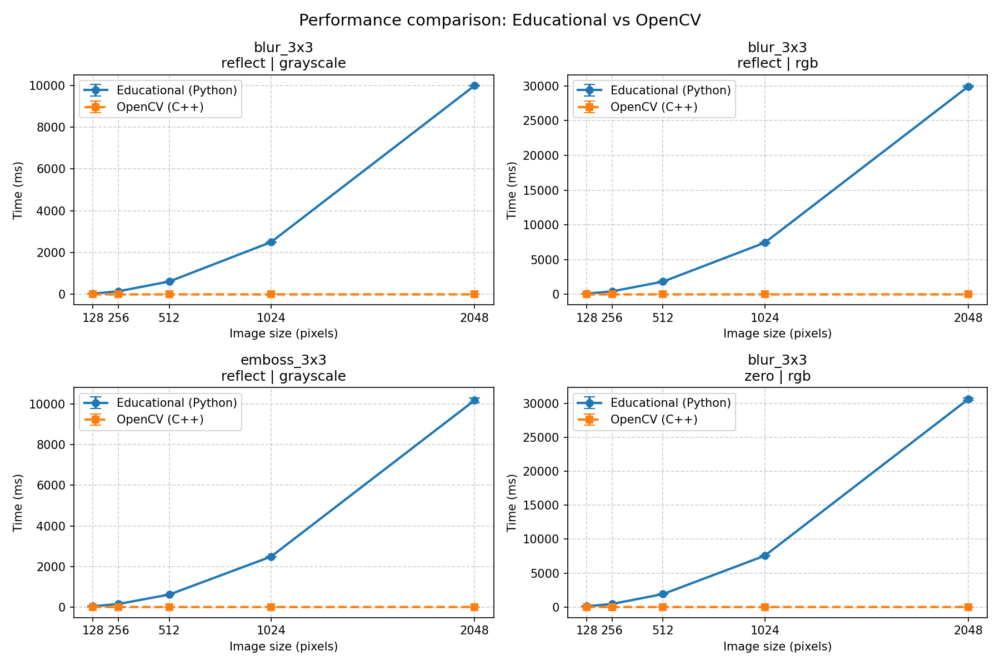

# Анализ производительности свёртки изображений: собственная реализация vs OpenCV

В данном разделе представлены результаты сравнения производительности **учебной реализации** свёртки (Python + NumPy) и эталонной библиотеки **OpenCV** (`cv2.filter2D`), написанной на C++ с аппаратной оптимизацией.

## Методика тестирования

- **Генерация тестовых изображений**: для чистоты измерений изображения не загружаются с диска, а **синтезируются случайным образом**. Это исключает влияние ввода‑вывода и обеспечивает воспроизводимость.
- **Размеры изображений**: `128×128`, `256×256`, `512×512`, `1024×1024`, `2048×2048`
- **Ядра**:  
  - `blur_3x3` – усредняющее размытие  
  - `emboss_3x3` – эффект тиснения  
- **Режимы обработки краёв**: `reflect` (отражение), `zero` (нулевое дополнение).
- **Типы изображений**: grayscale (один канал) и RGB (три канала).
- **Число замеров**: 5 повторений после прогрева.

Измерялось **среднее время выполнения** (в миллисекундах) одной операции свёртки (без учёта создания массивов и ввода‑вывода).

## Результаты производительности

| Размер | Ядро | Режим | Тип | Учебная реализация (ms) | OpenCV (ms) | **Ускорение (OpenCV быстрее в ... раз)** |
|--------|------|-------|-----|------------------------|-------------|------------------------------------------|
| 128 | blur_3x3 | reflect | rgb | 111.30 ± 1.21 | 0.026 ± 0.001 | **~4239×**                               |
| 256 | blur_3x3 | reflect | rgb | 445.89 ± 0.43 | 0.090 ± 0.0002 | **~4950×**                               |
| 256 | blur_3x3 | zero | rgb | 452.57 ± 2.55 | 0.090 ± 0.0001 | **~5017×**                               |
| 512 | blur_3x3 | reflect | rgb | 1842.51 ± 4.07 | 0.335 ± 0.003 | **~5503×**                               |
| 512 | blur_3x3 | zero | rgb | 1911.74 ± 47.28 | 0.341 ± 0.002 | **~5612×**                               |
| 1024 | blur_3x3 | reflect | grayscale | 2500.69 ± 7.75 | 0.458 ± 0.002 | **~5457×**                               |
| 1024 | blur_3x3 | reflect | rgb | 7442.48 ± 41.00 | 1.352 ± 0.037 | **~5506×**                               |
| 1024 | blur_3x3 | zero | rgb | 7565.40 ± 4.56 | 1.337 ± 0.015 | **~5657×**                               |
| 2048 | blur_3x3 | reflect | grayscale | 9986.06 ± 12.48 | 1.961 ± 0.027 | **~5093×**                               |
| 2048 | blur_3x3 | reflect | rgb | 29915.02 ± 146.28 | 6.081 ± 0.015 | **~4919×**                               |
| 2048 | blur_3x3 | zero | rgb | 30648.81 ± 166.92 | 6.076 ± 0.014 | **~5045×**                               |

*Полные данные (включая стандартные отклонения для всех комбинаций) доступны в файле `benchmark_results/benchmark_results.json`.*

### На графике ниже представлена зависимость времени выполнения свёртки от размера изображения для наиболее показательных конфигураций (ядро `blur_3x3`, режим обработки краев `reflect`, типы `grayscale` и `rgb`). 



## Выводы

### 1. Абсолютное сравнение производительности

- **OpenCV** – во всех сценариях отрабатывает в **4000–6000 раз быстрее** учебной реализации.
- **Учебная реализация** – самый медленный подход. Это ожидаемо, так как она написана на Python с вложенными циклами, которые выполняются интерпретатором.

### 2. Влияние размера изображения

Время выполнения для обеих реализаций растёт пропорционально числу пикселей (и квадрату стороны изображения).


## Заключение

Представленная учебная реализация полностью корректно выполняет математическую операцию свёртки. Однако её производительность непригодна для промышленного использования. В реальных проектах, где требуется скорость, необходимо применять оптимизированные библиотеки, такие как OpenCV.

---

*Данные получены с помощью скриптов `run_benchmark.py` и `visualize_benchmark.py`. Для воспроизведения результатов выполните:*  
```bash

uv run python benchmark/benchmark_convolution.py
# построение графика
uv run python benchmark/visualization.py
```